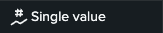

# Step 3 - A First Dashboard
To extract the information out of the raw data, dashboards can be used.

To create a dashboard, follow these steps:

1. Press `Apps` and select `Search and Reporting`
1. Press `Dashboards`
2. Press `Create New Dashbaord` on the top right
3. `Dashboard Title`: `Demo Dashboard`
4. Select `Dashboard Studio`
5. Select `Absolute`
6. Press `Create`

Now you are in the editor.
We will guide you now how to set up one metric; to be specific we want to create a metric displaying a single value which will represent all build events we have.

To do this do the following:
- Press `Add chart` 
- Select `Single value` 
- On the right hand side press now `+ Create search`. In this search we can now add the query which will give us the data displayed in the single value metric.
- Write `Number of Entries` as `Data source name`
- As `SPL query` we can now enter a query.
    - The query we are going to use is the following:
```
source="/mnt/*" sourcetype="_json"
| stats count
```
- The query contains of the following parameters:
    - `source`: the path of the data source, the asterisk is a wildcard in Splunk. This means that we are interested in all files within the path (`/mnt/*`)
    - `sourcetype`: the sourcetype of the data. `_json` is the sourcetype we specified earlier.
    - `|`: the pipe operator can be used chain together a series of search commands.
    - `stats count`: `stats count` performs an aggregation by counting the number of events that match the previous search criteria.
- As `Time range` make sure to select `Input`. This means that the time range can be modified using the `Global Time Range` which is always in the top left of your dashboard and can therefore be dynamic
- Press `Apply and close` on the bottom right
- Press `Save` in the top right
- Press `View` in the top right

You should now see a simple Dashboard.

You can always change back into the editor mode when clicking the `Edit` button.
There are multiple different types of metrics but they all follow a similar pattern. You select the metric you want to use and create a query representing the data to showcase using SPL.


