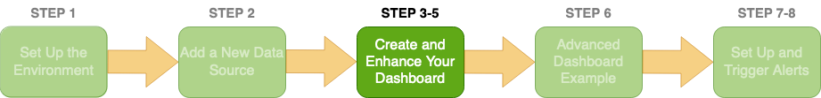

# Step 5 - Modifying The Dashboard
Since you now have a better idea about what the data looks like and can be used for, play around with `Dashboard Studio` and create some more metrics.

To get back to the Dashboard press `Dashboards` on the top bar,
then press `demo-dashboard`, and
press `Edit` in the top right.

Have fun!

