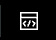

# Step 6 - A More Complex Demo Dashboard
We are pretty sure that you did a good job in the previous step!

We also prepared a more complex example of a Dashboard which you can import and chek out.
You can import it the following way:

1. Go to the Dashboard Overview pressing `Dashboard`
2. Press `Create New Dashbaord` on the top right
3. In `Dashboard Title` write `Demo Dashboard Complex`
4. Select `Dashboard Studio`
5. Select `Absolute`
6. Press `Create`
7. In the Dashboard on the top press the `Source Code` icon 
8. Copy and paste the content of `/home/example/demo-dashboard-complex.json` on the ubuntu machine in here
9. Press `Apply and close`
10. Press `Save`
11. Press on `View` and look over the Dashboard

If youre interested on how this dashboard was created and configured go back into the edit mode and click the elements you're interested in and inspect the configurations.

